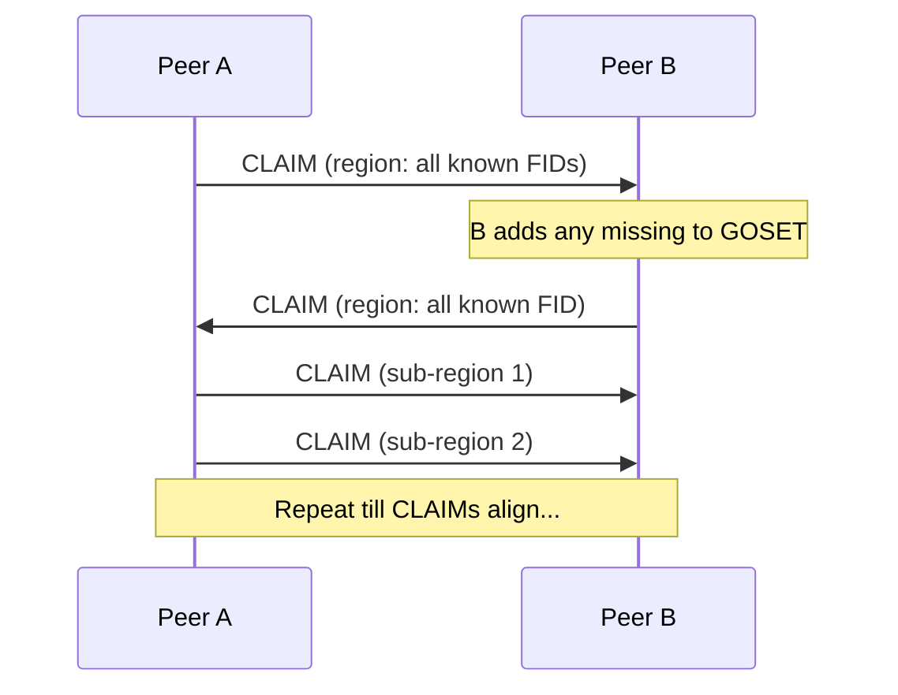
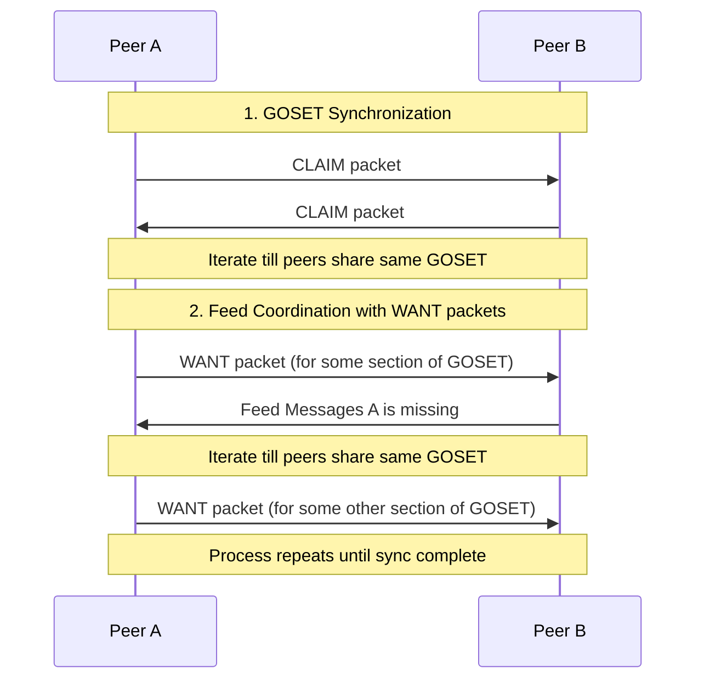

:warning: DRAFT VERSION!

---

# tiny-ssb-spec


This document outlines the history + thinking which leads us to this point, as
well as getting into the details required to implement the specification.

## 1. Design Decisions

Tiny-SSB was born of the question "Could we make [Secure
Scuttelbutt](https://github.com/ssbc) (SSB) **tiny** enough to work over
[LoRa](https://en.wikipedia.org/wiki/LoRa)?"

Core design decisions we replicate from SSB:
- **A.** each device has a unique cryptographic signing key-pair
- **B.** each "message" published by a device is signed by that device's
  cryptographic key
- **C.** each message has a unique ID which can be derived from it's header +
  content (`msg_id`)
- **D.** each message published by a device references the msg_id of last message
  that device published, such that all messages can be arranged as a linear
  linked-list. This data structure is known as `feed`.

Core design decisons we add for Tiny-SSB:
- **E.** each message must fit in a LoRa packet
- **F.** we assume no guarentee of a "connection" with a peer, there is only
  "broadcast" and "listen"
- **G.** we support "optional" side-chains off the side of a device's feed.


These decisions enable the following properties/ behaviors:
- **reliable "gossip"**: you can receive news from peerA "via peerB" and
  immediately check that whether it is fraudulent / has been tampered with
  (using the authoring device's public key + the message signature).
- **no history edits**: because the feed (linked-list) is grow/append-only, past
  messages cannot be removed, and messages cannot be inserted in the past.
- **easy replication coordination**: because all feeds are linear, it is enough
  to reference feeds public key and the "sequence" (how many messages) to be
  able to coordinate syncing feeds with another peer.
- **no missed messages**: because of the linked-list structure, you know
- **unique references**: all messages have a unique ID. This cannot be guessed
  ahead of time, which has nice side-effects, such as knowing that all
  references to messages are "backlinks" (point *backwards* in time).
- **new transports**: with LoRa as the benchmark tinySSB can access extremely
  long-distance (~10km), low energy (solar) communication, as well as
  pocket-to-pocket communication with Bluetooth Low-energy.

<details>
    <summary>More implications... (click to expand)</summary>

- you can publish to your own feed anytime... you are your own source of
- there is no password reset
    - if you lose your device / the signing keys, there is no recovering them
- your "database" is only a local, subjective snapshot based on what you've
  replicated
    - you will never have all the feeds (islands are ok!)
    - expect partitions / concurrency/ lags
    - expect eventual consistency
- there is no guarenteed ordering of messages
    - there is no central physical (or logical) machine that is "authoring",
      just many parallel peers.
    - the best you can do is "causal ordering" + an algorithm for tie-breaking
    - "timestamps" can work but any malicious device or device with a broken
      clock will wreck your system.
- "multi-device" identity is currently unsolved
    - i.e. people often want to be the same "author" on their phone AND laptop,
      such that people can @-mention, or DM with just one ID, but this is
      currently not possible 
    - you cannot use the same keys on 2 devices safely: if they both publish
      then you can break the "linear linked-list" expectation of your feed and
      you break replication
- multiple identities per device is easy
    - just add another signing key-pair

</details>

## 2. High-level Overview


## 3. Replication

### 3.1 Goals and Overview

The primary goal of replication in tinySSB is to efficiently coordinate the
exchange of messages between peers in a resource-constrained environment, while
ensuring that messages are delivered without being modified by peers within the
network. Specifically, tinySSB is designed to work over transports like LoRa,
which imposes strict limitations on packet size and bandwidth.

Key constraints that shape the replication protocol:
- **Packet size limitation**: All packets must fit within 120 bytes (LoRa has
constraints which depend on spread-factors, regional-specific considerations.
120 was chosen as a compromise that maximises payload, will still work with
Bluetooth Low Energy, and reliability - too large and more prone to errors)
- **Broadcast-only communication**: We assume no guarantee of a "connection"
with a peer; there is only "broadcast" and "listen"
- **Limited bandwidth**: Minimizing redundant message transmission is critical

The replication process in tinySSB consists of two main phases:

1. **Replication Setup Dance**: Peers coordinate to establish which feeds they want to replicate
   - Synchronize on a shared set of feed IDs (GOSET)
   - Express needs/wants for specific feed sequences

2. **Message Exchange**: Actual transfer of feed messages between peers
   - Sending messages in response to expressed wants
   - Processing and verifying received messages

This specification focuses primarily on the Replication Setup Dance, as it
contains the core protocols unique to tinySSB.

### 3.2 GOSET Protocol

#### 3.2.1 Rationale

In classic SSB, peers used 32-byte public keys (Feed IDs) to identify feeds
during replication. However, including these full IDs in every packet would
consume too much of the precious 120-byte packet size available in tinySSB.

The GOSET (Grow-Only SET) protocol solves this problem by allowing peers to
refer to feeds by their index in a shared, lexicographically sorted set of Feed
IDs. Once peers have synchronized their GOSETs, they can use these compact
indices instead of full 32-byte IDs in subsequent communication.

#### 3.2.2 GOSET Structure

A GOSET is a lexicographically sorted set of Feed IDs (32-byte public keys). The
sorting ensures that all peers who have the same set will have the same
ordering, allowing consistent indexing.

Properties of a GOSET:
- It can only grow (feeds can be added but not removed)
- It has a maximum size of 255 feeds (current limitation)
- All feeds in the set are sorted lexicographically
- Each feed can be referenced by its index (0-254) in the sorted set

#### 3.2.3 CLAIM Packet Format

The GOSET protocol uses CLAIM packets to synchronize the set of Feed IDs between
peers. A CLAIM packet describes a region of the lexicographically sorted GOSET.

A CLAIM packet has the following structure:

```
  |<------------------------------ 103 bytes ------------------------------>|
  
  ┌──────────┬──────┬────────────────┬────────────────┬────────────────┬────┐
  │ DMX      │ 'c'  │ Lowest FID     │ Highest FID    │ XOR            │ cnt│
  │ (7 bytes)│(1 B) │ (32 bytes)     │ (32 bytes)     │ (32 bytes)     │(1B)│
  └──────────┴──────┴────────────────┴────────────────┴────────────────┴────┘
```

Where:
- **DMX**: First 7 bytes of `SHA256(GOSET_DMX_STR)`, where `GOSET_DMX_STR = "tinySSB-0.1 GOset 1"`
- **Type**: Single byte with value 'c' (0x63) indicating a CLAIM packet
- **Lowest FID**: The lexicographically lowest Feed ID in the region
- **Highest FID**: The lexicographically highest Feed ID in the region
- **XOR**: The XOR-sum of all Feed IDs in the region
- **cnt**: The number of Feed IDs in the region (1-255)

The total length of a CLAIM packet is 103 bytes, which fits within the 120-byte limit.

### 3.3 GOSET Synchronization Process

The GOSET synchronization process allows peers to identify and share missing
Feed IDs. It works through a series of CLAIM packet that progressively narrow
down regions where peers have different sets.

#### 3.3.1 Basic Process

1. A peer broadcasts a CLAIM packet covering its entire GOSET
2. If another peer has a different set of Feed IDs in that region (detected by
   comparing the XOR and count), it responds with its own CLAIM for the same
region
3. Once a peer identifies a missing Feed ID, it adds it to its GOSET
4. The first peer then splits the region into two sub-regions and sends CLAIM
   packets for each
5. This process continues recursively, narrowing down to the specific Feed IDs
   that differ



#### 3.3.2 Detecting Differences

Peers detect differences in their GOSETs by comparing the `XOR`-sum and `count`
of Feed IDs in a region. Before comparing these values, however, a peer adds the
CLAIM's first and last Feed IDs to its own set in case they are not already
present.

1. If the `count`s matchs but the `XOR`-sums differ, there must be different
   Feed IDs in the region
2. If the `count`s differ, there are either missing or extra Feed IDs in the
   region

#### 3.3.3 Pseudo-code for GOSET Synchronization

```
function handleClaimPacket(claim):
    if claim.lowestFID not in localFIDs
        addToGOSET(claim.lowestFID)
    if claim.highestFID not in localFIDs
        addToGOSET(claim.highestFID)

    region = (claim.lowestFID, claim.highestFID)
    localFIDs = getLocalFIDsInRegion(region)
    
    localXOR = calculateXOR(localFIDs)
    localCount = localFIDs.length
    
    if localXOR == claim.XOR and localCount == claim.cnt:
        // Our GOSET matches for this region
        return
    
    
    // Our GOSET differs in this region
    // Send our claim for the same region
    sendClaim(region.lowestFID, region.highestFID, localXOR, localCount)
    
    // If we're the one with more FIDs, split the region and send sub-claims
    if localCount > claim.cnt:
        midPoint = calculateMidPoint(region)
        subRegion1 = (region.lowestFID, midPoint)
        subRegion2 = (midPoint, region.highestFID)
        
        sendClaimForRegion(subRegion1)
        sendClaimForRegion(subRegion2)
```

### 3.4 WANT Packet Protocol

#### 3.4.1 Purpose

Once peers have synchronized their GOSETs, they use WANT packets to:
1. Announce which feed sequences they already have
2. Request updates for feeds they're interested in
3. Listen for new messages on feeds they're following

#### 3.4.2 WANT Packet DMX

The DMX (DeMultipleX) field in a WANT vector is dynamically calculated based on
the current GOSET state. This ensures that WANT packets are only processed by
peers who share the same GOSET state, which is necessary for the index-based
feed references to work correctly.

The WANT `DMX` is calculated as follows:

```
DMX_PREFIX := b'tinyssb-v0'
WANT_STR := b'want'
GOSET_state := XOR of all feed IDs in the current GOSET

DMX := first 7 bytes of SHA256(DMX_PREFIX | WANT_STR | GOSET_state)
```

Where `|` denotes concatenation.

This dynamic DMX calculation is crucial because:
1. It ties the WANT vector to a specific GOSET state
2. It allows peers to quickly determine if they share the same GOSET
3. It prevents misinterpretation of feed indices when GOSETs differ

#### 3.4.3 WANT Packet Format

A WANT vector packet has the following structure:

```
  |<----------------120 bytes max---------------->|
     7             x                   113-x
  ┌─────┬──────────────────────┬──────────────────┐
  │ DMX │ payload (BIPF)       │ padding          │
  └─────┴──────────────────────┴──────────────────┘
```

Where:
- `DMX`: The 7-byte WANT_DMX calculated as described above
- `payload`: BIPF-encoded array containing offset and sequence numbers
- `padding`: Zeros added to bring the packet size up to 120 bytes

#### 3.4.4 WANT Packet Payload

The payload of a WANT vector is a BIPF-encoded array with the following structure:

```
[offset, seq_1, seq_2, ..., seq_k]
```

Where:
- `offset`: The starting index into the GOSET for this WANT vector
- `seq_n`: The sequence number wanted for the feed at GOSET index (offset+n)

For example, a decoded payload of `[3, 302, 104, 27]` would mean:
- Start at index 3 in the GOSET
- I have up to sequence 302 for the feed at index 3
- I have up to sequence 104 for the feed at index 4
- I have up to sequence 27 for the feed at index 5

This compact representation allows a peer to express wants for multiple feeds
without including the full 32-byte Feed IDs.

### 3.5 Replication Process Overview

The complete replication process in tinySSB follows these steps:

1. **GOSET Synchronization**:
   - Peers exchange CLAIM packets to ensure they share the same set of Feed IDs
   - This establishes a common indexing scheme for feeds

2. **Feed Coordination with WANT packets**:
   - Peers broadcast WANT packets to announce their current state and request updates
   - Other peers respond by sending the requested feed packets
   - This process repeats until synchronization is complete



The actual packet formats and exchange processes for feed messages will be
covered in later sections of this specification.

### 3.6 Limitations and Considerations

#### 3.6.1 GOSET Size Limitation

The current implementation limits the GOSET to 255 feeds (as the count field is
a single byte). This may be a constraint for larger networks or applications
with many users.

#### 3.6.2 Spam Resistance

The GOSET protocol does not inherently protect against spam. A malicious peer
could potentially flood the network with many different Feed IDs, causing the
GOSET to grow unnecessarily large. Application-level filtering or trust
mechanisms may be needed to mitigate this.

#### 3.6.3 Partition Tolerance

tinySSB is designed to be highly partition-tolerant. Peers can continue to
operate independently when disconnected and will automatically synchronize when
connectivity is restored. The GOSET protocol ensures that peers can efficiently
determine what they're missing after a partition.

#### 3.6.4 Eventual Consistency

The replication process guarantees eventual consistency: given sufficient
connectivity over time, all peers will eventually have the same view of all
feeds they're interested in. However, there are no real-time guarantees, and
different peers may have different views of the network at any given moment.


## 4. Feeds

### 4.1 Feed Structure and Concepts

A feed in tinySSB is an append-only log of signed messages created by a single
device. Each feed is identified by a unique cryptographic signing key-pair, with
the public key serving as the feed's identifier (Feed ID or FID). This design is
inherited from the original Secure Scuttlebutt (SSB) protocol but adapted for
constrained environments.

Key properties of tinySSB feeds:

- **Append-only**: New messages can only be added to the end of a feed; existing
messages cannot be modified or deleted.  - **Linked-list structure**: Each
message contains a reference to the previous message in the feed, forming a
linear chain.  - **Cryptographically signed**: Every message is signed by the
feed's private key, ensuring authenticity and integrity.  - **Immutable**: Once
published, messages cannot be changed without invalidating the chain.  -
**Size-constrained**: All messages must fit within the 120-byte limit imposed by
LoRa.

#### Feed Identity

Each feed is uniquely identified by a 32-byte ed25519 public key (Feed ID). The
corresponding private key is used to sign all messages published to that feed.
This cryptographic identity ensures that:

1. Messages can be verified as authentic (created by the claimed author) 2.
Messages cannot be tampered with without detection 3. Feeds from different
devices remain distinct and independently verifiable

#### Feed Structure

A feed consists of a sequence of messages, each with a unique sequence number
starting from 1. Each message references the previous message's ID, creating a
linked list:

```
Feed
┃
┣━━ Message 1 (sequence=1, prev=0000..00)
┃
┣━━ Message 2 (sequence=2, prev=msg_id_1)
┃
┣━━ Message 3 (sequence=3, prev=msg_id_2)
┃
┗━━ ...
```

This linked structure ensures that:

1. The integrity of the entire feed can be verified
2. We can succinctly communicate how many messages from a feed with have (the
sequence)

### 4.2 DMX Header Mechanism

The DMX (DeMultipleX) header is a critical innovation in tinySSB that allows for
efficient packet identification without requiring the full feed ID, sequence
number, and previous message ID to be included in each packet. This saves
valuable space in the constrained 120-byte packet size.

#### 4.2.1 Purpose of DMX

The DMX header serves multiple purposes:

1. **Compact identification**: Reduces the space needed to identify a packet's
position in a feed
2. **Predictable linking**: Allows peers to calculate the expected DMX for the
next message in a feed
3. **Efficient filtering**: Enables quick determination of whether a received
packet belongs to a feed of interest

#### 4.2.2 DMX Calculation

The DMX is defined as the first 7 bytes of the SHA256 hash of the following data
concatenated in order:

| Name               | Bytes   | Description                                                                       |
| :----------------- | :------ | :-------------------------------------------------------------------------------- |
| `dmx_prefix`       | 10      | Protocol version identifier (default: `tinyssb-v0`)                               |
| `feed_id`          | 32      | ed25519 public key of the feed                                                    |
| `sequence`         | 4       | Sequence number of this packet in the feed, in big-endian format                  |
| `prev_message_id`  | 20      | ID of the previous message in this feed                                           |

```
dmx_material = dmx_prefix + feed_id + sequence + prev_message_id
dmx = sha256(dmx_material).slice(0, 7)
```
Where `+` denotes concatenation.

#### 4.2.3 DMX Usage

When a peer has message N of a feed, it can calculate the expected DMX for
message N+1. When receiving broadcast packets, the peer can quickly check if any
packet matches this expected DMX, indicating it's the next message in a feed of
interest.

This mechanism is particularly valuable in broadcast-only environments where
peers need to efficiently filter relevant packets from the broadcast medium.

#### 4.2.4 Message ID Calculation

Each message in a feed has a unique message ID (`msg_id`) that is used for
referencing in subsequent messages. The `msg_id` is calculated as:

```
msg_id_material = dmx_prefix + feed_id + sequence + prev_message_id + dmx +
                  message_type + content + signature
msg_id = sha256(msg_id_material).slice(0, 20)
```

Important notes:
- The `msg_id` is 20 bytes long
- For the first message in a feed (`sequence` = 1), the `prev_message_id` is all
zeros (20 bytes)
- `message_type` is described in section 4.3

### 4.3 Main Chain Packet Format

All main chain packets in tinySSB share a common structure, regardless of their
specific type. This consistent format ensures that packets can be properly
identified, verified, and processed.

#### 4.3.1 General Packet Structure

A main chain packet consists of the following components concatenated in order:

```
  |<---------------------------- 120 bytes ------------------------------>|

  ┌──────────┬─────────────┬───────────────────────┬──────────────────────┐
  │ DMX      │ Message Type│ Content               │ Signature            │
  │ (7 bytes)│ (1 byte)    │ (48 bytes)            │ (64 bytes)           │
  └──────────┴─────────────┴───────────────────────┴──────────────────────┘
```

Where:
- **DMX**: 7-byte header calculated as described in section 4.2
- **Message Type**: 1-byte type identifier
- **Content**: 48 bytes of payload data (format depends on packet type)
- **Signature**: 64-byte ed25519 signature

The total size of a main chain packet is exactly 120 bytes, which is the maximum
size allowed by the LoRa transport.

#### 4.3.2 Signature Generation

The signature is an ed25519 signature of the concatenation of the following data:

| Name                | Description                                              |
| :------------------ | :------------------------------------------------------- |
| `dmx_prefix`        | Protocol version identifier (default: `tinyssb-v0`)      |
| `feed_id`           | 32-byte public key of the feed                           |
| `sequence`          | Sequence number of this packet in the feed               |
| `prev_message_id`   | 20-byte ID of the previous message in this feed          |
| `dmx`               | 7-byte DMX header                                        |
| `message_type`       | 1-byte type identifier                                   |
| `content`           | 48-byte content payload                                  |

```
signing_material = dmx_prefix + feed_id + sequence + prev_message_id +
                   dmx + message_type + content
signature = sign(signing_material, signing_key)
```

#### 4.3.3 Message Type Byte

The packet type byte determines how the content field should be interpreted:

| Code | Meaning                                                |
| :--- | :----------------------------------------------------- |
| 0    | Fixed-size content (fits entirely within the 48 bytes) |
| 1    | Variable-size content (may use side chains)            |

Additional packet types may be defined in future versions of the protocol.

See Section 5 for more information about each type.

### 4.4 Feed Limitations and Considerations

#### 4.4.1 Security Considerations

1. **Key management**: Loss of a feed's private key means permanent loss of the
ability to publish to that feed
2. **No feed deletion**: Once published, messages cannot be deleted from the
network
3. **Feed forking**: If the same private key is used on multiple devices, feed
forking can occur, breaking the linear structure

#### 4.4.2 Performance Considerations

1. **DMX calculation overhead**: Computing and verifying DMX headers requires
cryptographic hash operations
2. **Feed synchronization**: Peers must exchange WANT packets to coordinate
which messages they need

#### 4.4.3 Future Improvements

1. **Partial replication**: Allow peers to replicate only portions of feeds
they're interested in
2. **Feed compaction**: Mechanisms to summarize or compact old feed entries

## 5. Message Types

tinySSB supports different message types to accommodate various content sizes and structures.

- [Type 0 - Fixed Size Messages](message_type/00.md)
- [Type 1 - Variable Sized Messages](message_type/01.md)


## 6. Acknowledgements

TinySSB was originally designed by [Christian Tschudin](https://github.com/tschudin) (aka @cft).
This specification was the work of [@cft](https://github.com/tschudin), [@mixmix](https://mixmix.nz), [@nanomonkey](https://github.com/nanomonkey)
