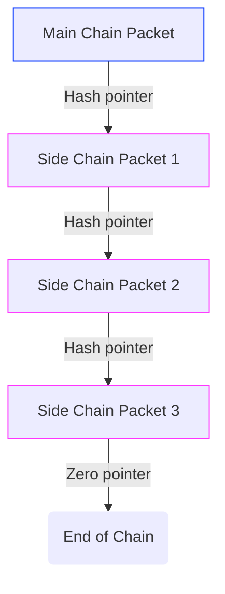
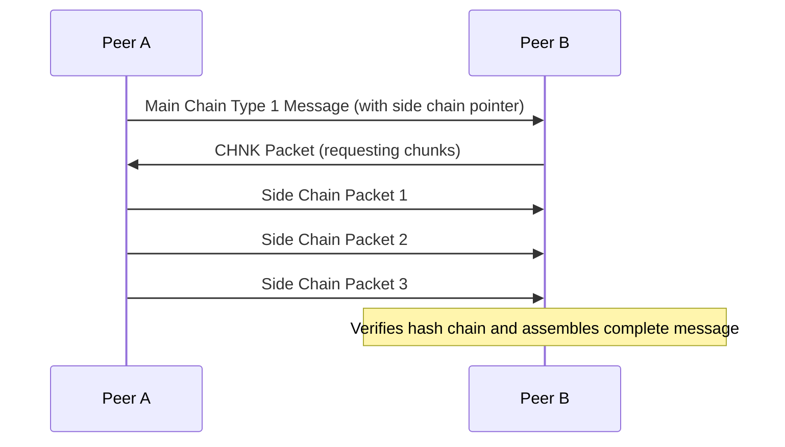

# tinySSB Replication Specification

## 2. Replication

### 2.1 Goals and Overview

The primary goal of replication in tinySSB is to efficiently coordinate the exchange of messages between peers in a resource-constrained environment. Specifically, tinySSB is designed to work over transports like LoRa, which imposes strict limitations on packet size and bandwidth.

Key constraints that shape the replication protocol:
- **Packet size limitation**: All packets must fit within 120 bytes (LoRa constraint)
- **Broadcast-only communication**: We assume no guarantee of a "connection" with a peer; there is only "broadcast" and "listen"
- **Limited bandwidth**: Minimizing redundant message transmission is critical

The replication process in tinySSB consists of two main phases:

1. **Replication Setup Dance**: Peers coordinate to establish which feeds they want to replicate
   - Synchronize on a shared set of feed IDs (GOSET)
   - Express needs/wants for specific feed sequences

2. **Message Exchange**: Actual transfer of feed messages between peers
   - Sending messages in response to expressed wants
   - Processing and verifying received messages

This specification focuses primarily on the Replication Setup Dance, as it contains the core protocols unique to tinySSB.

### 2.2 GOSET Protocol

#### 2.2.1 Rationale

In classic SSB, peers used 32-byte public keys (Feed IDs) to identify feeds during replication. However, including these full IDs in every packet would consume too much of the precious 120-byte packet size available in tinySSB.

The GOSET (Grow-Only SET) protocol solves this problem by allowing peers to refer to feeds by their index in a shared, lexicographically sorted set of Feed IDs. Once peers have synchronized their GOSETs, they can use these compact indices instead of full 32-byte IDs in subsequent communication.

#### 2.2.2 GOSET Structure

A GOSET is a lexicographically sorted set of Feed IDs (32-byte public keys). The sorting ensures that all peers who have the same set will have the same ordering, allowing consistent indexing.

Properties of a GOSET:
- It can only grow (feeds can be added but not removed)
- It has a maximum size of 255 feeds (current limitation)
- All feeds in the set are sorted lexicographically
- Each feed can be referenced by its index (0-254) in the sorted set

#### 2.2.3 CLAIM Packet Format

The GOSET protocol uses CLAIM packets to synchronize the set of Feed IDs between peers. A CLAIM packet describes a region of the lexicographically sorted GOSET.

A CLAIM packet has the following structure:

```
  |<------------------------------ 103 bytes ------------------------------>|
  
  ┌──────────┬──────┬────────────────┬────────────────┬────────────────┬────┐
  │ DMX      │ 'c'  │ Lowest FID     │ Highest FID    │ XOR            │ cnt│
  │ (7 bytes)│(1 B) │ (32 bytes)     │ (32 bytes)     │ (32 bytes)     │(1B)│
  └──────────┴──────┴────────────────┴────────────────┴────────────────┴────┘
```

Where:
- **DMX**: First 7 bytes of `SHA256(GOSET_DMX_STR)`, where `GOSET_DMX_STR = "tinySSB-0.1 GOset 1"`
- **Type**: Single byte with value 'c' (0x63) indicating a CLAIM packet
- **Lowest FID**: The lexicographically lowest Feed ID in the region
- **Highest FID**: The lexicographically highest Feed ID in the region
- **XOR**: The XOR-sum of all Feed IDs in the region
- **cnt**: The number of Feed IDs in the region (1-255)

The total length of a CLAIM packet is 103 bytes, which fits within the 120-byte limit.

### 2.3 GOSET Synchronization Process

The GOSET synchronization process allows peers to identify and share missing Feed IDs. It works through a series of CLAIM packet that progressively narrow down regions where peers have different sets.

#### 2.3.1 Basic Process

1. A peer broadcasts a CLAIM packet covering its entire GOSET
2. If another peer has a different set of Feed IDs in that region (detected by comparing the XOR and count), it responds with its own CLAIM for the same region
3. Once a peer identifies a missing Feed ID, it adds it to its GOSET
4. The first peer then splits the region into two sub-regions and sends CLAIM packets for each
5. This process continues recursively, narrowing down to the specific Feed IDs that differ


#### 2.3.2 Detecting Differences

Peers detect differences in their GOSETs by comparing the `XOR`-sum and `count` of Feed IDs in a region:

1. If the `count`s matchs but the `XOR`-sums differ, there must be different Feed IDs in the region
2. If the `count`s differ, there are either missing or extra Feed IDs in the region

#### 2.3.3 Pseudo-code for GOSET Synchronization

```
function handleClaimPacket(claim):
    region = (claim.lowestFID, claim.highestFID)
    localFIDs = getLocalFIDsInRegion(region)
    
    localXOR = calculateXOR(localFIDs)
    localCount = localFIDs.length
    
    if localXOR == claim.XOR and localCount == claim.cnt:
        // Our GOSET matches for this region
        return
    
    if region contains only one FID:
        // We found a specific difference
        if claim.cnt == 1 and localCount == 0:
            // We're missing this FID
            addToGOSET(claim.lowestFID)
        return
    
    // Our GOSET differs in this region
    // Send our claim for the same region
    sendClaim(region.lowestFID, region.highestFID, localXOR, localCount)
    
    // If we're the one with more FIDs, split the region and send sub-claims
    if localCount > claim.cnt:
        midPoint = calculateMidPoint(region)
        subRegion1 = (region.lowestFID, midPoint)
        subRegion2 = (midPoint, region.highestFID)
        
        sendClaimForRegion(subRegion1)
        sendClaimForRegion(subRegion2)
```

### 2.4 WANT Packet Protocol

#### 2.4.1 Purpose

Once peers have synchronized their GOSETs, they use WANT packets to:
1. Announce which feed sequences they already have
2. Request updates for feeds they're interested in
3. Listen for new messages on feeds they're following

#### 2.4.2 WANT Packet DMX

The DMX (DeMultipleX) field in a WANT vector is dynamically calculated based on the current GOSET state. This ensures that WANT packets are only processed by peers who share the same GOSET state, which is necessary for the index-based feed references to work correctly.

The WANT `DMX` is calculated as follows:

```
DMX_PREFIX := b'tinyssb-v0'
WANT_STR := b'want'
GOSET_state := XOR of all feed IDs in the current GOSET

DMX := first 7 bytes of SHA256(DMX_PREFIX | WANT_STR | GOSET_state)
```

Where `|` denotes concatenation.

This dynamic DMX calculation is crucial because:
1. It ties the WANT vector to a specific GOSET state
2. It allows peers to quickly determine if they share the same GOSET
3. It prevents misinterpretation of feed indices when GOSETs differ

#### 2.4.3 WANT Packet Format

A WANT vector packet has the following structure:

```
  |<----------------120 bytes max---------------->|
     7             x                   113-x
  ┌─────┬──────────────────────┬──────────────────┐
  │ DMX │ payload (BIPF)       │ padding          │
  └─────┴──────────────────────┴──────────────────┘
```

Where:
- `DMX`: The 7-byte WANT_DMX calculated as described above
- `payload`: BIPF-encoded array containing offset and sequence numbers
- `padding`: Zeros added to bring the packet size up to 120 bytes

#### 2.4.4 WANT Packet Payload

The payload of a WANT vector is a BIPF-encoded array with the following structure:

```
[offset, seq_1, seq_2, ..., seq_k]
```

Where:
- `offset`: The starting index into the GOSET for this WANT vector
- `seq_n`: The sequence number wanted for the feed at GOSET index (offset+n)

For example, a decoded payload of `[3, 302, 104, 27]` would mean:
- Start at index 3 in the GOSET
- I have up to sequence 302 for the feed at index 3
- I have up to sequence 104 for the feed at index 4
- I have up to sequence 27 for the feed at index 5

This compact representation allows a peer to express wants for multiple feeds without including the full 32-byte Feed IDs.

### 2.5 Replication Process Overview

The complete replication process in tinySSB follows these steps:

1. **GOSET Synchronization**:
   - Peers exchange CLAIM packets to ensure they share the same set of Feed IDs
   - This establishes a common indexing scheme for feeds

2. **Feed Coordination with WANT packets**:
   - Peers broadcast WANT packets to announce their current state and request updates
   - Other peers respond by sending the requested feed packets
   - This process repeats until synchronization is complete


The actual packet formats and exchange processes for feed messages will be covered in later sections of this specification.

### 2.6 Limitations and Considerations

#### 2.6.1 GOSET Size Limitation

The current implementation limits the GOSET to 255 feeds (as the count field is a single byte). This may be a constraint for larger networks or applications with many users.

#### 2.6.2 Spam Resistance

The GOSET protocol does not inherently protect against spam. A malicious peer could potentially flood the network with many different Feed IDs, causing the GOSET to grow unnecessarily large. Application-level filtering or trust mechanisms may be needed to mitigate this.

#### 2.6.3 Partition Tolerance

tinySSB is designed to be highly partition-tolerant. Peers can continue to operate independently when disconnected and will automatically synchronize when connectivity is restored. The GOSET protocol ensures that peers can efficiently determine what they're missing after a partition.

#### 2.6.4 Eventual Consistency

The replication process guarantees eventual consistency: given sufficient connectivity over time, all peers will eventually have the same view of all feeds they're interested in. However, there are no real-time guarantees, and different peers may have different views of the network at any given moment.


## 3. Feeds

### 3.1 Feed Structure and Concepts

A feed in tinySSB is an append-only log of signed messages created by a single
device. Each feed is identified by a unique cryptographic signing key-pair, with
the public key serving as the feed's identifier (Feed ID or FID). This design is
inherited from the original Secure Scuttlebutt (SSB) protocol but adapted for
constrained environments.

Key properties of tinySSB feeds:

- **Append-only**: New messages can only be added to the end of a feed; existing
messages cannot be modified or deleted.  - **Linked-list structure**: Each
message contains a reference to the previous message in the feed, forming a
linear chain.  - **Cryptographically signed**: Every message is signed by the
feed's private key, ensuring authenticity and integrity.  - **Immutable**: Once
published, messages cannot be changed without invalidating the chain.  -
**Size-constrained**: All messages must fit within the 120-byte limit imposed by
LoRa.

#### Feed Identity

Each feed is uniquely identified by a 32-byte ed25519 public key (Feed ID). The
corresponding private key is used to sign all messages published to that feed.
This cryptographic identity ensures that:

1. Messages can be verified as authentic (created by the claimed author) 2.
Messages cannot be tampered with without detection 3. Feeds from different
devices remain distinct and independently verifiable

#### Feed Structure

A feed consists of a sequence of messages, each with a unique sequence number
starting from 1. Each message references the previous message's ID, creating a
linked list:

```
Feed
┃
┣━━ Message 1 (sequence=1, prev=0000..00)
┃
┣━━ Message 2 (sequence=2, prev=msg_id_1)
┃
┣━━ Message 3 (sequence=3, prev=msg_id_2)
┃
┗━━ ...
```

This linked structure ensures that:

1. The integrity of the entire feed can be verified
2. We can succinctly communicate how many messages from a feed with have (the
sequence)

### 3.2 DMX Header Mechanism

The DMX (DeMultipleX) header is a critical innovation in tinySSB that allows for
efficient packet identification without requiring the full feed ID, sequence
number, and previous message ID to be included in each packet. This saves
valuable space in the constrained 120-byte packet size.

#### 3.2.1 Purpose of DMX

The DMX header serves multiple purposes:

1. **Compact identification**: Reduces the space needed to identify a packet's
position in a feed
2. **Predictable linking**: Allows peers to calculate the expected DMX for the
next message in a feed
3. **Efficient filtering**: Enables quick determination of whether a received
packet belongs to a feed of interest

#### 3.2.2 DMX Calculation

The DMX is defined as the first 7 bytes of the SHA256 hash of the following data
concatenated in order:

| Name               | Bytes   | Description                                                                       |
| :----------------- | :------ | :-------------------------------------------------------------------------------- |
| `dmx_prefix`       | 10      | Protocol version identifier (default: `tinyssb-v0`)                               |
| `feed_id`          | 32      | ed25519 public key of the feed                                                    |
| `sequence`         | 4       | Sequence number of this packet in the feed, in big-endian format                  |
| `prev_message_id`  | 20      | ID of the previous message in this feed                                           |

```
dmx_material = dmx_prefix + feed_id + sequence + prev_message_id
dmx = sha256(dmx_material).slice(0, 7)
```
Where `+` denotes concatenation.

#### 3.2.3 DMX Usage

When a peer has message N of a feed, it can calculate the expected DMX for
message N+1. When receiving broadcast packets, the peer can quickly check if any
packet matches this expected DMX, indicating it's the next message in a feed of
interest.

This mechanism is particularly valuable in broadcast-only environments where
peers need to efficiently filter relevant packets from the broadcast medium.

#### 3.2.4 Message ID Calculation

Each message in a feed has a unique message ID (`msg_id`) that is used for
referencing in subsequent messages. The `msg_id` is calculated as:

```
msg_id_material = dmx_prefix + feed_id + sequence + prev_message_id + dmx +
                  message_type + content + signature
msg_id = sha256(msg_id_material).slice(0, 20)
```

Important notes:
- The `msg_id` is 20 bytes long
- For the first message in a feed (`sequence` = 1), the `prev_message_id` is all
zeros (20 bytes)
- `message_type` is described in section 3.3

### 3.3 Main Chain Packet Format

All main chain packets in tinySSB share a common structure, regardless of their
specific type. This consistent format ensures that packets can be properly
identified, verified, and processed.

#### 3.3.1 General Packet Structure

A main chain packet consists of the following components concatenated in order:

```
  |<-------------------------- 120 bytes max ---------------------------->|

  ┌──────────┬─────────────┬───────────────────────┬──────────────────────┐
  │ DMX      │ Message Type│ Content               │ Signature            │
  │ (7 bytes)│ (1 byte)    │ (48 bytes)            │ (64 bytes)           │
  └──────────┴─────────────┴───────────────────────┴──────────────────────┘
```

Where:
- **DMX**: 7-byte header calculated as described in section 3.2
- **Message Type**: 1-byte type identifier
- **Content**: 48 bytes of payload data (format depends on packet type)
- **Signature**: 64-byte ed25519 signature

The total size of a main chain packet is exactly 120 bytes, which is the maximum size allowed by the LoRa transport.

#### 3.3.2 Signature Generation

The signature is an ed25519 signature of the concatenation of the following data:

| Name                | Description                                              |
| :------------------ | :------------------------------------------------------- |
| `dmx_prefix`        | Protocol version identifier (default: `tinyssb-v0`)      |
| `feed_id`           | 32-byte public key of the feed                           |
| `sequence`          | Sequence number of this packet in the feed               |
| `prev_message_id`   | 20-byte ID of the previous message in this feed          |
| `dmx`               | 7-byte DMX header                                        |
| `message_type`       | 1-byte type identifier                                   |
| `content`           | 48-byte content payload                                  |

```
signing_material = dmx_prefix + feed_id + sequence + prev_message_id +
                   dmx + message_type + content
signature = sign(signing_material, signing_key)
```

#### 3.3.3 Message Type Byte

The packet type byte determines how the content field should be interpreted:

| Code | Meaning                                                |
| :--- | :----------------------------------------------------- |
| 0    | Fixed-size content (fits entirely within the 48 bytes) |
| 1    | Variable-size content (may use side chains)            |

Additional packet types may be defined in future versions of the protocol.

See Section 4 for more information about each type.

### 3.4 Feed Limitations and Considerations

#### 3.4.1 Size Constraints

The 120-byte packet size limitation imposes several constraints on tinySSB feeds:

1. **Content size**: Main chain packets can only contain up to 48 bytes of content
2. **Message overhead**: The DMX, packet type, and signature consume 72 bytes of
each packet

These constraints make tinySSB most suitable for applications that primarily
exchange small text messages or sensor data.

#### 3.4.2 Security Considerations

1. **Key management**: Loss of a feed's private key means permanent loss of the
ability to publish to that feed
2. **No feed deletion**: Once published, messages cannot be deleted from the
network
3. **Feed forking**: If the same private key is used on multiple devices, feed
forking can occur, breaking the linear structure

#### 3.4.3 Performance Considerations

1. **DMX calculation overhead**: Computing and verifying DMX headers requires
cryptographic hash operations
2. **Feed synchronization**: Peers must exchange WANT packets to coordinate
which messages they need

#### 3.4.4 Future Improvements

1. **Partial replication**: Allow peers to replicate only portions of feeds
they're interested in
2. **Feed compaction**: Mechanisms to summarize or compact old feed entries

## 4. Message Types

### 4.1. Type 0 - Fixed Size Messages

Type 0 messages are the simplest form of tinySSB messages, designed for content
that fits **exactly** in the 48-byte content field of a main chain packet. These
messages follow the standard main chain packet format described in section 3.3,
with specific rules for the content field.

#### 4.1.1 Purpose and Use Cases

Type 0 messages are ideal for:
- Short text messages
- Status updates
- Sensor readings
- Control commands
- References to external data

#### 4.1.2 Detailed Packet Structure

```
  |<------------------------------ 120 bytes ---------------------------->|

  ┌──────────┬─────────────┬───────────────────────┬──────────────────────┐
  │ DMX      │ Type = 0    │ Content               │ Signature            │
  │ (7 bytes)│ (1 byte)    │ (48 bytes)            │ (64 bytes)           │
  └──────────┴─────────────┴───────────────────────┴──────────────────────┘
```

#### 4.1.3 Content Format

The 48-byte content field in Type 0 messages typically contains BIPF-encoded
data. BIPF (Binary In-Place Format) is a compact binary encoding format similar
to CBOR or MessagePack, but optimized for in-place parsing without memory
allocation.

<details>
  <summary>More info</summary>

The content structure is application-specific, but common patterns include:

1. **Simple text messages**:
   ```
   BIPF.encode(["text", "Hello, tinySSB world!"])
   ```

2. **Structured data**:
   ```
   BIPF.encode({
     type: "temperature",
     value: 23.5,
     unit: "C",
     timestamp: 1620000000
   })
   ```

3. **References to external data**:
   ```
   BIPF.encode({
     type: "reference",
     hash: [byte array of external content hash]
   })
   ```
If the encoded content is less than 48 bytes, it is padded with zeros to fill the field.

</details>


#### 4.1.4 Processing and Verification

When a peer receives a Type 0 message, it:

1. Verifies the DMX header matches an expected message (based of feed, sequence,
etc.)
2. Verifies the signature using the feed's public key
3. Processes the content according to application-specific rules
4. Updates its record of the feed's latest sequence number
5. Calculates and stores the message ID for future reference
6. Calculates the DMX of the next expected message for that feed, in readiness
to listen for its arrival

---

### 4.2 Type 1 - Variable Sized Messages

Type 1 messages are designed for content that may exceed the 48-byte limit of a
main chain packet. They use a special format for the content field that may
include a pointer to side chain packets containing additional data.


```
                        Main Chain

  ╭─Message 23 (type 0)────╮  ╭─Message 24 (type 1)─────╮  ╭─--
  │                        │  │                         │  │ 
  │ └── Content (48 bytes) │  │ ├── Size: 320           │  │ 
◀─│                        │◀─│ ├── Initial Content     │◀─│ 
  │                        │  │ └── Pointer             │  │ 
  ╰────────────────────────╯  ╰─────────────────────────╯  ╰─--
                                      │
                                      ▼
                              ╭─Chunk 1─────────────────╮
                              │                         │
                              │ ├── Content Chunk       │
                              │ └── Pointer             │
                              │                         │
                              ╰─────────────────────────╯
                                      │
               Side Chain             ▼
                              ╭─Chunk 2─────────────────╮
                              │                         │
                              │ ├── Content Chunk       │
                              │ └── Pointer             │
                              │                         │
                              ╰─────────────────────────╯
                                      │
                                      ▼
                              ╭─Chunk 3─────────────────╮
                              │                         │
                              │ ├── Content Chunk       │
                              │ └── Null pointer        │
                              │                         │
                              ╰─────────────────────────╯

```

#### 4.2.1 Purpose and When to Use

Type 1 messages should be used when:
- The content exceeds 48 bytes
- The content is less than 48 bytes (and you don't want to pad)

#### 4.2.2 Detailed Packet Structure

```
  |<------------------------------ 120 bytes ---------------------------->|

  ┌──────────┬─────────────┬───────────────────────┬──────────────────────┐
  │ DMX      │ Type = 1    │ Content               │ Signature            │
  │ (7 bytes)│ (1 byte)    │ (48 bytes)            │ (64 bytes)           │
  └──────────┴─────────────┴───────────────────────┴──────────────────────┘
```

The content field has a special structure:

```
  |<------------------------ 48 bytes ---------------------->|

  ┌────────┬───────────────────────────┬─────────────────────┐
  │ VL     │ Content Data              │ Pointer/Padding     │
  │ (var)  │ (var)                     │ (var)               │
  └────────┴───────────────────────────┴─────────────────────┘
```

Where:
- **VL**: Variable-length encoded size of the total content
- **Content Data**: Either the first chunk of the full content data, or the whole content
- **Pointer/Padding**: Either a 20-byte hash pointer to side chain packets or padding

#### 4.2.3 Content Scenarios

There are two scenarios for Type 1 message content:

1. **Short content** (fits entirely within the content fields 48 bytes):
   ```
   VL + Content + Padding
   ```
   If the variable-length encoded size plus the full content fits in less than
   48 bytes, no pointer is used. Any remaining space is filled with padding.
   (No pointer is present.)

2. **Long content** (requires side chains):
   ```
   VL + Initial Content Chunk + Pointer
   ```
   If the content is too large to fit, the content field contains the
   variable-length encoded size, as much of the content as will fit, and a
   20-byte hash pointer to the first side chain packet.


#### 4.2.4 Side Chain Packet Format

Side chain packets are used to store content that doesn't fit in a main chain
packet. They have a simpler structure than main chain packets, as they don't
need the same level of cryptographic verification (they are implicitly verified
through the hash chain).

##### Packet Structure

```
  |<-------------------------- 120 bytes --------------------------->|

  ┌────────────────────────────────────────────────┬─────────────────┐
  │ Content Chunk                                  │ Pointer Hash    │
  │ (100 bytes)                                    │ (20 bytes)      │
  └────────────────────────────────────────────────┴─────────────────┘
```

Where:
- **Content**: 100 bytes of content data, or up to 100 of content data padded up to 100 bytes for the last packet
- **Pointer Hash**: 20-byte SHA256 hash of the next side chain packet, or all
zeros for the last packet

Side chain packets do not include a DMX header or signature, as they are
referenced and implicitly authenticated by the hash chain starting from the main
chain packet.

#### 4.2.5 Side Chain Construction

Side chains are constructed in reverse order, starting from the last packet:

1. The initial chunk which will fit in the main-chain is split off
2. The remaining content is divided into chunks of 100 bytes each
3. The last fragment is padded to 100 bytes and appended with 20 zero bytes
4. The SHA256 hash of this last packet is calculated
5. The second-to-last fragment is appended with this hash to form the second-to-last packet
6. This process continues until all fragments are processed
7. The hash of the first side chain packet is included in the main chain packet



This construction ensures that:
1. The integrity of the entire side chain can be verified
2. Side chain packets can be identified and linked correctly
3. The end of the side chain can be detected

#### 4.2.6 CHNK Packet Protocol

The CHNK Packet protocol is used to coordinate the replication of side chain
packets between peers. It is similar to the WANT vector protocol used for main
chain packets but specifically designed for requesting side chain chunks.

##### CHNK DMX Calculation

The DMX for CHNK packets is calculated as:

```
CHNK_PREFIX := b'tinyssb-v0'
CHNK_STR := b'blob'
GOSET_state := XOR of all feed IDs in the current GOSET

CHNK_DMX := first 7 bytes of SHA256(CHNK_PREFIX | CHNK_STR | GOSET_state)
```

This dynamic DMX calculation ensures that CHNK packets are only processed by
peers who share the same GOSET state.

##### CHNK Packet Format

```
  |<----------------120 bytes max---------------->|

     7             x                   113-x
  ┌─────┬──────────────────────┬──────────────────┐
  │ DMX │ payload (BIPF)       │ padding          │
  └─────┴──────────────────────┴──────────────────┘
```

Where:
- **DMX**: The 7-byte CHNK_DMX calculated as described above
- **payload**: BIPF-encoded array of triplets specifying needed chunks
- **padding**: Zeros added to bring the packet size up to 120 bytes

##### CHNK Payload Structure

The payload of a CHNK vector is a BIPF-encoded array of triplets:

```
[ (f1,s1,c1), (f2,s2,c2), ... (fn,sn,cn) ]
```

Where each triplet specifies:
- **f**: Feed index in the GOSET
- **s**: Sequence number of the main chain message
- **c**: Chunk number (which side chain packet is needed)

For example, a decoded payload of `[(3, 42, 2), (5, 17, 1)]` would mean:
- I need chunk 2 of message 42 from the feed at GOSET index 3
- I need chunk 1 of message 17 from the feed at GOSET index 5

##### CHNK Exchange Process

The CHNK vector exchange process follows these steps:

1. A peer receives a main chain Type 1 message with a side chain pointer
2. The peer broadcasts a CHNK vector requesting the side chain chunks
3. Peers who have the requested chunks respond by broadcasting them
4. The requesting peer collects the chunks and verifies the hash chain
5. Once all chunks are received, the peer can process the complete message



This protocol ensures efficient replication of large messages across the network
while maintaining the 120-byte packet size constraint.
