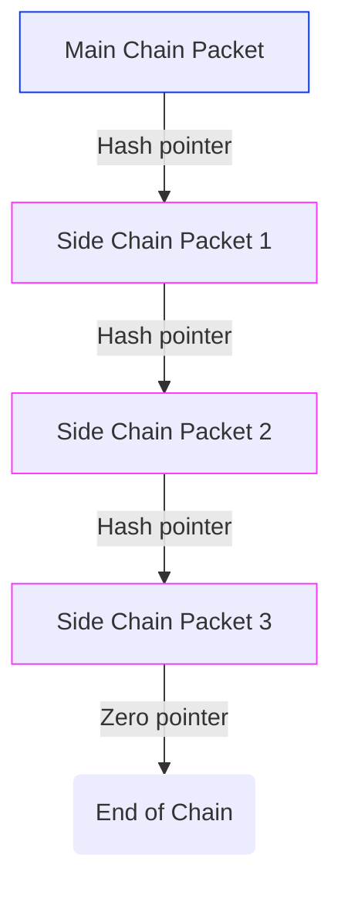
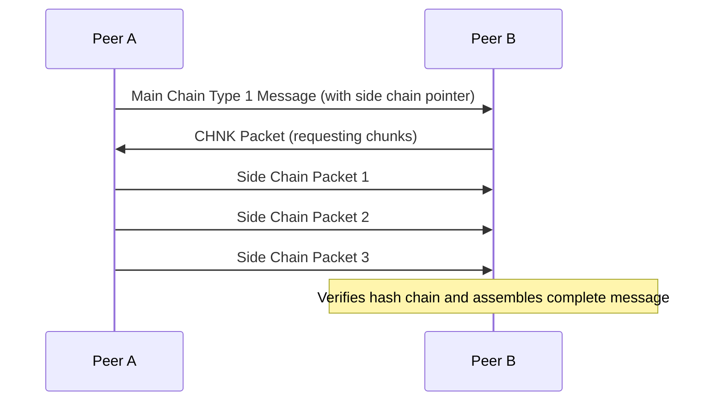

# Type 1 - Variable Sized Messages

Type 1 messages are designed for content that may exceed the 48-byte limit of a
main chain packet. They use a special format for the content field that may
include a pointer to side chain packets containing additional data.


```
                        Main Chain

  ╭─Message 23 (type 0)────╮  ╭─Message 24 (type 1)─────╮  ╭─--
  │                        │  │                         │  │ 
  │ └── Content (48 bytes) │  │ ├── Size: 320           │  │ 
◀─│                        │◀─│ ├── Initial Content     │◀─│ 
  │                        │  │ └── Pointer             │  │ 
  ╰────────────────────────╯  ╰─────────────────────────╯  ╰─--
                                      │
                                      ▼
                              ╭─Chunk 1─────────────────╮
                              │                         │
                              │ ├── Content Chunk       │
                              │ └── Pointer             │
                              │                         │
                              ╰─────────────────────────╯
                                      │
               Side Chain             ▼
                              ╭─Chunk 2─────────────────╮
                              │                         │
                              │ ├── Content Chunk       │
                              │ └── Pointer             │
                              │                         │
                              ╰─────────────────────────╯
                                      │
                                      ▼
                              ╭─Chunk 3─────────────────╮
                              │                         │
                              │ ├── Content Chunk       │
                              │ └── Null pointer        │
                              │                         │
                              ╰─────────────────────────╯

```

## Purpose and When to Use

Type 1 messages should be used when:
- The content exceeds 48 bytes
- The content is less than 48 bytes (and you don't want to pad)

## Detailed Packet Structure

```
  |<------------------------------ 120 bytes ---------------------------->|

  ┌──────────┬─────────────┬───────────────────────┬──────────────────────┐
  │ DMX      │ Type = 1    │ Content               │ Signature            │
  │ (7 bytes)│ (1 byte)    │ (48 bytes)            │ (64 bytes)           │
  └──────────┴─────────────┴───────────────────────┴──────────────────────┘
```

The content field has a special structure:

```
  |<------------------------ 48 bytes ---------------------->|

  ┌────────┬───────────────────────────┬─────────────────────┐
  │ VL     │ Content Data              │ Pointer/Padding     │
  │ (var)  │ (var)                     │ (var)               │
  └────────┴───────────────────────────┴─────────────────────┘
```

Where:
- **VL**: The length of the raw content is encoded in the VL field, whose length
  is variable, depending on the content length to encode. Specifically, tinySSB
  uses the `VARINT` format of
  [protobuf](https://protobuf.dev/programming-guides/encoding/#varints), where
  the encoding is defined as follows:
  > Each byte in a varint, except the last byte, has the most significant bit
  > (msb) set – this indicates that there are further bytes to come. The lower 7
  > bits of each byte are used to store the two's complement representation of
  > the number in groups of 7 bits, least significant group first.
- **Content Data**: Either the first chunk of the full content data, or the whole content
- **Pointer/Padding**: Either a 20-byte hash pointer to side chain packets or padding

## Content Scenarios

There are two scenarios for Type 1 message content:

1. **Short content** (fits entirely within the content fields 48 bytes):
   ```
   VL + Content + Padding
   ```
   If the variable-length encoded size plus the full content fits in less than
   48 bytes, no pointer is used. Any remaining space is filled with padding.
   (No pointer is present.)

2. **Long content** (requires side chains):
   ```
   VL + Initial Content Chunk + Pointer
   ```
   If the content is too large to fit, the content field contains the
   variable-length encoded size, as much of the content as will fit, and a
   20-byte hash pointer to the first side chain packet.


## Side Chain Packet Format

Side chain packets are used to store content that doesn't fit in a main chain
packet. They have a simpler structure than main chain packets, as they don't
need the same level of cryptographic verification (they are implicitly verified
through the hash chain).

### Packet Structure

```
  |<-------------------------- 120 bytes --------------------------->|

  ┌────────────────────────────────────────────────┬─────────────────┐
  │ Content Chunk                                  │ Pointer Hash    │
  │ (100 bytes)                                    │ (20 bytes)      │
  └────────────────────────────────────────────────┴─────────────────┘
```

Where:
- **Content**: 100 bytes of content data, or up to 100 of content data padded up
  to 100 bytes for the last packet
- **Pointer Hash**: 20-byte SHA256 hash of the next side chain packet, or all
  zeros for the last packet

Side chain packets do not include a DMX header or signature, as they are
referenced and implicitly authenticated by the hash chain starting from the main
chain packet.

## Side Chain Construction

Side chains are constructed in reverse order, starting from the last packet:

1. The initial chunk which will fit in the main-chain is split off
2. The remaining content is divided into chunks of 100 bytes each
3. The last fragment is padded to 100 bytes and appended with 20 zero bytes
4. The SHA256 hash of this last packet is calculated
5. The second-to-last fragment is appended with this hash to form the
   second-to-last packet
6. This process continues until all fragments are processed
7. The hash of the first side chain packet is included in the main chain packet



This construction ensures that:
1. The integrity of the entire side chain can be verified
2. Side chain packets can be identified and linked correctly
3. The end of the side chain can be detected

## CHNK Packet Protocol

The CHNK Packet protocol is used to coordinate the replication of side chain
packets between peers. It is similar to the WANT vector protocol used for main
chain packets but specifically designed for requesting side chain chunks.

### CHNK DMX Calculation

The DMX for CHNK packets is calculated as:

```
CHNK_PREFIX := b'tinyssb-v0'
CHNK_STR := b'blob'
GOSET_state := XOR of all feed IDs in the current GOSET

CHNK_DMX := first 7 bytes of SHA256(CHNK_PREFIX | CHNK_STR | GOSET_state)
```

This dynamic DMX calculation ensures that CHNK packets are only processed by
peers who share the same GOSET state.

### CHNK Packet Format

```
  |<----------------120 bytes max---------------->|

     7             x                   113-x
  ┌─────┬──────────────────────┬──────────────────┐
  │ DMX │ payload (BIPF)       │ padding          │
  └─────┴──────────────────────┴──────────────────┘
```

Where:
- **DMX**: The 7-byte CHNK_DMX calculated as described above
- **payload**: BIPF-encoded array of triplets specifying needed chunks
- **padding**: Zeros added to bring the packet size up to 120 bytes

### CHNK Payload Structure

The payload of a CHNK vector is a BIPF-encoded array of triplets:

```
[ (f1,s1,c1), (f2,s2,c2), ... (fn,sn,cn) ]
```

Where each triplet specifies:
- **f**: Feed index in the GOSET
- **s**: Sequence number of the main chain message
- **c**: Chunk number (which side chain packet is needed)

For example, a decoded payload of `[(3, 42, 2), (5, 17, 1)]` would mean:
- I need chunk 2 of message 42 from the feed at GOSET index 3
- I need chunk 1 of message 17 from the feed at GOSET index 5

### CHNK Exchange Process

The CHNK vector exchange process follows these steps:

1. A peer receives a main chain Type 1 message with a side chain pointer
2. The peer broadcasts a CHNK vector requesting the side chain chunks
3. Peers who have the requested chunks respond by broadcasting them
4. The requesting peer collects the chunks and verifies the hash chain
5. Once all chunks are received, the peer can process the complete message



This protocol ensures efficient replication of large messages across the network
while maintaining the 120-byte packet size constraint.
