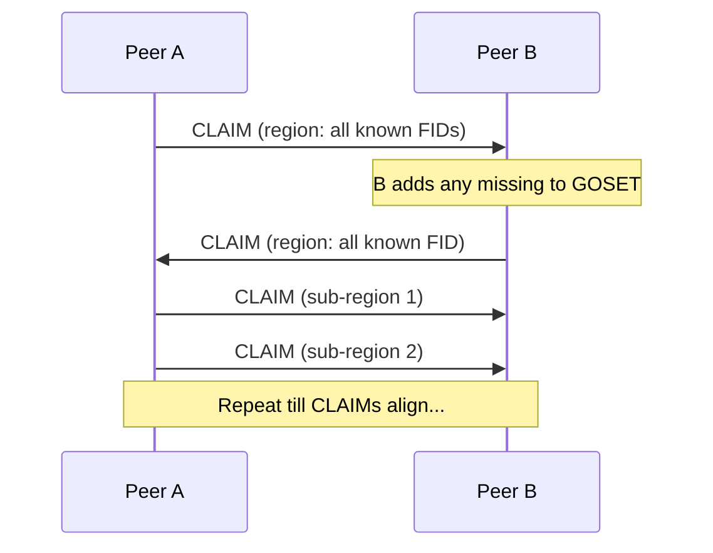
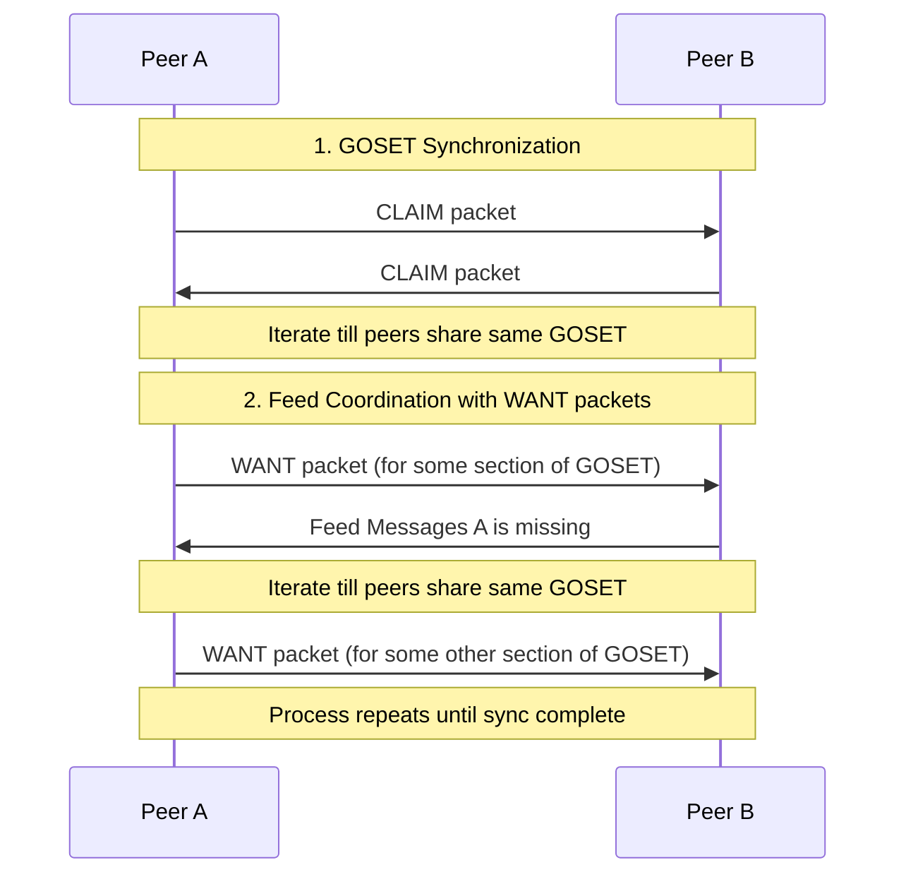

# tinySSB Replication Specification

## 2. Replication

### 2.1 Goals and Overview

The primary goal of replication in tinySSB is to efficiently coordinate the exchange of messages between peers in a resource-constrained environment. Specifically, tinySSB is designed to work over transports like LoRa, which imposes strict limitations on packet size and bandwidth.

Key constraints that shape the replication protocol:
- **Packet size limitation**: All packets must fit within 120 bytes (LoRa constraint)
- **Broadcast-only communication**: We assume no guarantee of a "connection" with a peer; there is only "broadcast" and "listen"
- **Limited bandwidth**: Minimizing redundant message transmission is critical

The replication process in tinySSB consists of two main phases:

1. **Replication Setup Dance**: Peers coordinate to establish which feeds they want to replicate
   - Synchronize on a shared set of feed IDs (GOSET)
   - Express needs/wants for specific feed sequences

2. **Message Exchange**: Actual transfer of feed messages between peers
   - Sending messages in response to expressed wants
   - Processing and verifying received messages

This specification focuses primarily on the Replication Setup Dance, as it contains the core protocols unique to tinySSB.

### 2.2 GOSET Protocol

#### 2.2.1 Rationale

In classic SSB, peers used 32-byte public keys (Feed IDs) to identify feeds during replication. However, including these full IDs in every packet would consume too much of the precious 120-byte packet size available in tinySSB.

The GOSET (Grow-Only SET) protocol solves this problem by allowing peers to refer to feeds by their index in a shared, lexicographically sorted set of Feed IDs. Once peers have synchronized their GOSETs, they can use these compact indices instead of full 32-byte IDs in subsequent communication.

#### 2.2.2 GOSET Structure

A GOSET is a lexicographically sorted set of Feed IDs (32-byte public keys). The sorting ensures that all peers who have the same set will have the same ordering, allowing consistent indexing.

Properties of a GOSET:
- It can only grow (feeds can be added but not removed)
- It has a maximum size of 255 feeds (current limitation)
- All feeds in the set are sorted lexicographically
- Each feed can be referenced by its index (0-254) in the sorted set

#### 2.2.3 CLAIM Packet Format

The GOSET protocol uses CLAIM packets to synchronize the set of Feed IDs between peers. A CLAIM packet describes a region of the lexicographically sorted GOSET.

A CLAIM packet has the following structure:

```
  |<------------------------------ 103 bytes ------------------------------>|
  +----------+------+----------------+----------------+----------------+----+
  | DMX      | 'c'  | Lowest FID     | Highest FID    | XOR            | cnt|
  | (7 bytes)|(1 B) | (32 bytes)     | (32 bytes)     | (32 bytes)     |(1B)|
  +----------+------+----------------+----------------+----------------+----+
```

Where:
- **DMX**: First 7 bytes of `SHA256(GOSET_DMX_STR)`, where `GOSET_DMX_STR = "tinySSB-0.1 GOset 1"`
- **Type**: Single byte with value 'c' (0x63) indicating a CLAIM packet
- **Lowest FID**: The lexicographically lowest Feed ID in the region
- **Highest FID**: The lexicographically highest Feed ID in the region
- **XOR**: The XOR-sum of all Feed IDs in the region
- **cnt**: The number of Feed IDs in the region (1-255)

The total length of a CLAIM packet is 103 bytes, which fits within the 120-byte limit.

### 2.3 GOSET Synchronization Process

The GOSET synchronization process allows peers to identify and share missing Feed IDs. It works through a series of CLAIM packet that progressively narrow down regions where peers have different sets.

#### 2.3.1 Basic Process

1. A peer broadcasts a CLAIM packet covering its entire GOSET
2. If another peer has a different set of Feed IDs in that region (detected by comparing the XOR and count), it responds with its own CLAIM for the same region
3. Once a peer identifies a missing Feed ID, it adds it to its GOSET
4. The first peer then splits the region into two sub-regions and sends CLAIM packets for each
5. This process continues recursively, narrowing down to the specific Feed IDs that differ



#### 2.3.2 Detecting Differences

Peers detect differences in their GOSETs by comparing the `XOR`-sum and `count` of Feed IDs in a region:

1. If the `count`s matchs but the `XOR`-sums differ, there must be different Feed IDs in the region
2. If the `count`s differ, there are either missing or extra Feed IDs in the region

#### 2.3.3 Pseudo-code for GOSET Synchronization

```
function handleClaimPacket(claim):
    region = (claim.lowestFID, claim.highestFID)
    localFIDs = getLocalFIDsInRegion(region)
    
    localXOR = calculateXOR(localFIDs)
    localCount = localFIDs.length
    
    if localXOR == claim.XOR and localCount == claim.cnt:
        // Our GOSET matches for this region
        return
    
    if region contains only one FID:
        // We found a specific difference
        if claim.cnt == 1 and localCount == 0:
            // We're missing this FID
            addToGOSET(claim.lowestFID)
        return
    
    // Our GOSET differs in this region
    // Send our claim for the same region
    sendClaim(region.lowestFID, region.highestFID, localXOR, localCount)
    
    // If we're the one with more FIDs, split the region and send sub-claims
    if localCount > claim.cnt:
        midPoint = calculateMidPoint(region)
        subRegion1 = (region.lowestFID, midPoint)
        subRegion2 = (midPoint, region.highestFID)
        
        sendClaimForRegion(subRegion1)
        sendClaimForRegion(subRegion2)
```

### 2.4 WANT Packet Protocol

#### 2.4.1 Purpose

Once peers have synchronized their GOSETs, they use WANT packets to:
1. Announce which feed sequences they already have
2. Request updates for feeds they're interested in
3. Listen for new messages on feeds they're following

#### 2.4.2 WANT Packet DMX

The DMX (DeMultipleX) field in a WANT vector is dynamically calculated based on the current GOSET state. This ensures that WANT packets are only processed by peers who share the same GOSET state, which is necessary for the index-based feed references to work correctly.

The WANT `DMX` is calculated as follows:

```
DMX_PREFIX := b'tinyssb-v0'
WANT_STR := b'want'
GOSET_state := XOR of all feed IDs in the current GOSET

DMX := first 7 bytes of SHA256(DMX_PREFIX | WANT_STR | GOSET_state)
```

Where `|` denotes concatenation.

This dynamic DMX calculation is crucial because:
1. It ties the WANT vector to a specific GOSET state
2. It allows peers to quickly determine if they share the same GOSET
3. It prevents misinterpretation of feed indices when GOSETs differ

#### 2.4.3 WANT Packet Format

A WANT vector packet has the following structure:

```
  |<----------------120 bytes max------------------>|

     7             x              113-x
  +-----+----------------------+------------------+
  | DMX | payload (BIPF)       | padding          |
  +-----+----------------------+------------------+
```

Where:
- `DMX`: The 7-byte WANT_DMX calculated as described above
- `payload`: BIPF-encoded array containing offset and sequence numbers
- `padding`: Zeros added to bring the packet size up to 120 bytes

#### 2.4.4 WANT Packet Payload

The payload of a WANT vector is a BIPF-encoded array with the following structure:

```
[offset, seq_1, seq_2, ..., seq_k]
```

Where:
- `offset`: The starting index into the GOSET for this WANT vector
- `seq_n`: The sequence number wanted for the feed at GOSET index (offset+n)

For example, a decoded payload of `[3, 302, 104, 27]` would mean:
- Start at index 3 in the GOSET
- I have up to sequence 302 for the feed at index 3
- I have up to sequence 104 for the feed at index 4
- I have up to sequence 27 for the feed at index 5

This compact representation allows a peer to express wants for multiple feeds without including the full 32-byte Feed IDs.

### 2.5 Replication Process Overview

The complete replication process in tinySSB follows these steps:

1. **GOSET Synchronization**:
   - Peers exchange CLAIM packets to ensure they share the same set of Feed IDs
   - This establishes a common indexing scheme for feeds

2. **Feed Coordination with WANT packets**:
   - Peers broadcast WANT packets to announce their current state and request updates
   - Other peers respond by sending the requested feed packets
   - This process repeats until synchronization is complete



The actual packet formats and exchange processes for feed messages will be covered in later sections of this specification.

### 2.6 Limitations and Considerations

#### 2.6.1 GOSET Size Limitation

The current implementation limits the GOSET to 255 feeds (as the count field is a single byte). This may be a constraint for larger networks or applications with many users.

#### 2.6.2 Spam Resistance

The GOSET protocol does not inherently protect against spam. A malicious peer could potentially flood the network with many different Feed IDs, causing the GOSET to grow unnecessarily large. Application-level filtering or trust mechanisms may be needed to mitigate this.

#### 2.6.3 Partition Tolerance

tinySSB is designed to be highly partition-tolerant. Peers can continue to operate independently when disconnected and will automatically synchronize when connectivity is restored. The GOSET protocol ensures that peers can efficiently determine what they're missing after a partition.

#### 2.6.4 Eventual Consistency

The replication process guarantees eventual consistency: given sufficient connectivity over time, all peers will eventually have the same view of all feeds they're interested in. However, there are no real-time guarantees, and different peers may have different views of the network at any given moment.
